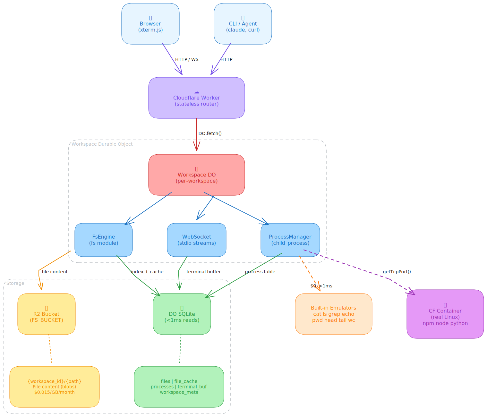

# nodemode

Map Node.js primitives to Cloudflare Workers + R2 + Durable Objects + Containers.

## Mapping

| Node.js | Cloudflare |
|---------|------------|
| `fs` | R2 (file content) + DO SQLite (directory index & cache) |
| `child_process` | DO built-in commands + Containers for heavy workloads |
| `stdio` | WebSocket with DO SQLite persistence |
| `process` | DO instance state |

## Quick Start

```bash
npx nodemode init my-workspace
cd my-workspace
npx wrangler dev
```

## Architecture



Commands are tiered:
- **Built-in** (cat, ls, grep, echo, pwd, ...) — execute directly in DO, $0 cost, <1ms
- **Container** (npm, node, git, ...) — spawn Cloudflare Container, ~$0.02/hr

## Storage

- **R2** — unlimited file storage keyed by `{workspace_id}/{path}`
- **DO SQLite** — directory index, file cache (<64KB), process table, terminal buffer

## Deploy

```bash
npx nodemode deploy
```

Requires Cloudflare Workers Paid plan (for Durable Objects + R2).

## Docs

See the [documentation site](docs/) built with Astro Starlight.

## License

MIT
